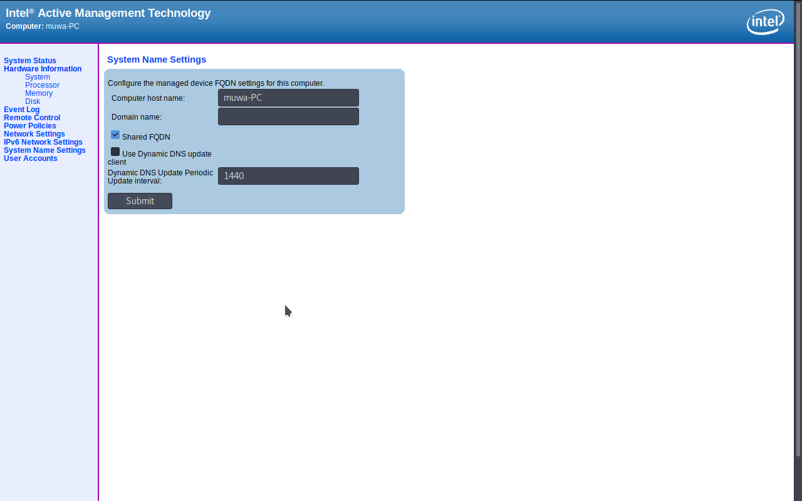

## Intel AMT Authorization Bypass
List of CVE :
* CVE-2017-5689

## Description
This bug will bypass authorization header with just replacing response value with empty value.  
The paper described this :  
```c
The part where the call to strncmp() occurs seems most interesting here:

-------------------------------------------------------------------
| if(strncmp(computed_response, user_response, response_length))  |
| exit(0x99);                                                     |
-------------------------------------------------------------------
  
Given an empty string the strncmp() evaluates to `zero` thus accepting and invalid response as a valid one.
No doubt it’s just a programmer’s mistake, but here it is: keep silence when challenged and you’re in.
```
I found these quite interesting because the bug is similar to authorization bypass on hpe-ilo that  
found on 2017 too (`there's alot mass exploitation back then`). There's a lot poc in github about these bug  
but many of them is just a checker vuln ...  

From my perspective, these bug will lead to high severity because we can control almost all feature on  
intel amt device/server/pc. So i create simple poc for creating an `evil` administrator :)

## Images


### Credits & Thx for :
* [Silent Bob is Silent](https://theswissbay.ch/pdf/_to_sort/Silent-Bob-is-Silent.pdf)
